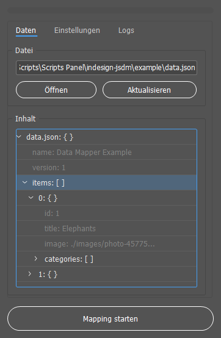
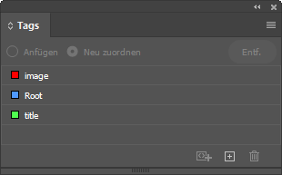
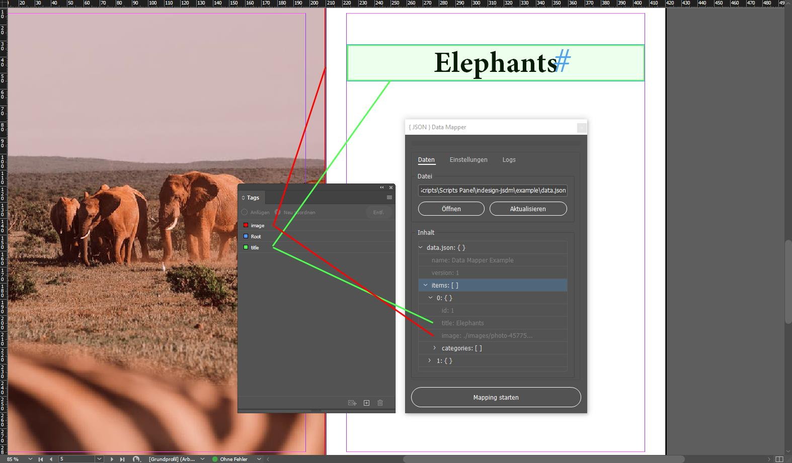

# JSON Data Mapper (JSDM)

InDesign script to automate JSON data imports.



## Installation

Just download the repository and extract everything in your InDesign scripts folder.
On Window systems the path is something like: ```~\AppData\Roaming\Adobe\InDesign\Version 16.0\de_DE\Scripts\Scripts Panel```.
You can also easily figure out the path by opening the scripts panel and then right click on the scripts folder -> "Reveal in Explorer".

## Usage

Open the XML Tags panel. Create some tags named like the keys you wish to map from the JSON file. Assign the tags to text frames, placeholders, etc...



Open the scripts panel with Ctrl + Alt + F11 and run jsdm.jsx. Open a JSON file. From the JSDM Contents panel choose the data you would like to map. Hit "Start Mapping" - Done!



## Example

You can check the ```document.idml``` in the ```example``` folder.
